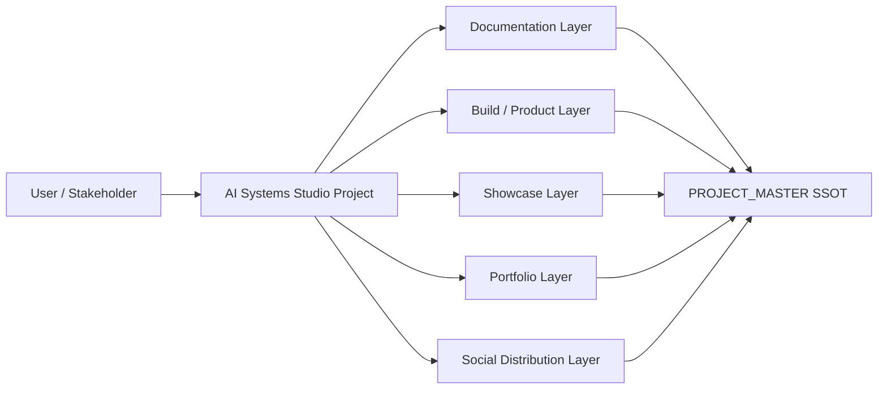
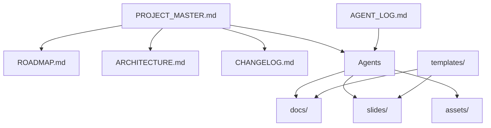

# Architecture Diagram Template

Use this template as a source for Mermaid or diagram tooling.

## Context Diagram (Mermaid)

## Container Diagram Skeleton

## Diagram Notes
- Keep naming consistent with actual repository paths.
- Update diagrams whenever architecture decisions change.
- Reflect accepted ADRs in visual flow changes.
